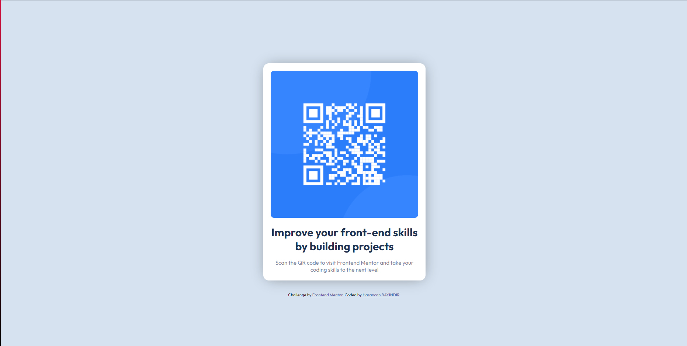

### What I learned

```html
Some CSS code I learned
```

```css
@media (min-width:500px) {
    .container {
        width: 400px;
    }
}

body {
    display: flex;
    flex-direction: column;
    align-items: center;
    justify-content: center;
    height: calc(100vh - 1px);
}

```


### Useful resources

>>>>>>> b1481617a58efce1c93c90e1ae97c0c77c883dfa
- Resource 1 www.cssgenerator.org/ - This helped me for some shadow settings.
